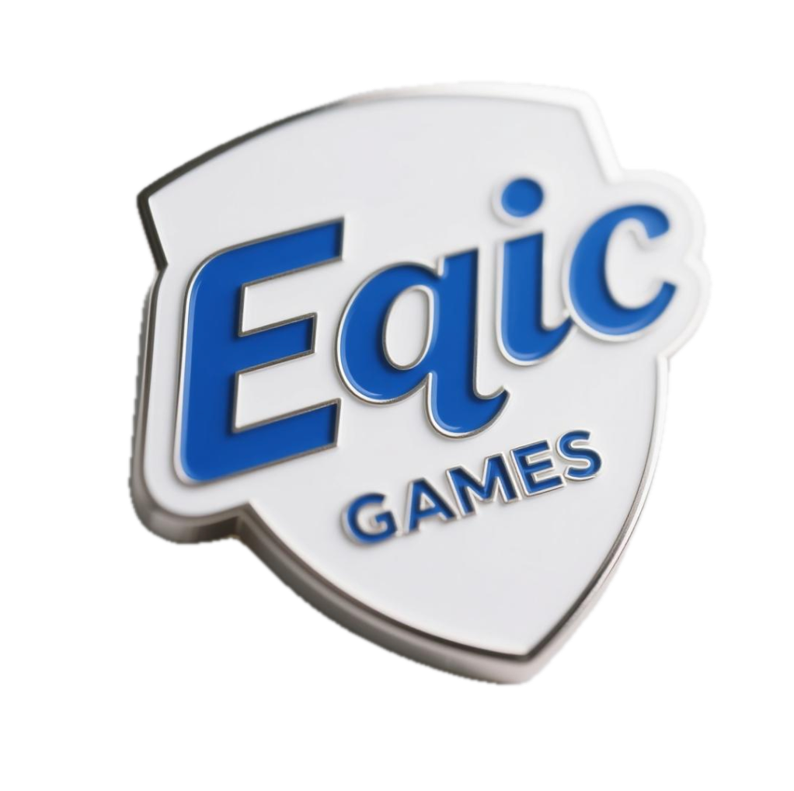

#  Eqic Games - Web3 Gaming Platform

[](https://x.com/EqicGames)
[](https://eqicgame.world)

## Metaverse Creation Protocol (MCP) - The Future of Gaming

Eqic Games is revolutionizing the gaming ecosystem by bridging traditional gaming with blockchain technology through our proprietary **Metaverse Creation Protocol (MCP)**. Our platform enables true asset ownership, cross-platform interoperability, and seamless blockchain integration.


## Core Technologies

### 🔗 Advanced SDK Integration

Our platform provides a powerful SDK for seamless game integration:

```javascript
// Initialize the Eqic Games SDK
import { EqicSDK } from '@eqic/game-sdk';

const eqicSDK = new EqicSDK({
  gameId: 'your-registered-game-id',
  environment: 'production', // or 'development'
  apiKey: 'your-api-key'
});

// Connect to the MCP ecosystem
await eqicSDK.init();

// Register event listeners for cross-game asset transfers
eqicSDK.on('assetReceived', (asset) => {
  console.log(`Received new asset: ${asset.name} (${asset.rarity})`);
  playerInventory.addItem(convertToGameAsset(asset));
});
```

### 🎮 Game Asset System

Create, manage, and trade in-game assets with full ownership:

```javascript
// Define an asset schema for your game
const weaponSchema = {
  assetType: 'weapon',
  properties: {
    damage: { type: 'number', min: 1, max: 100 },
    durability: { type: 'number', min: 1, max: 1000 },
    level: { type: 'number', min: 1, max: 50 },
    elementType: { type: 'string', enum: ['fire', 'water', 'earth', 'air'] }
  },
  rarityLevels: [
    { name: 'common', probability: 0.6, modifiers: { damage: 1, durability: 1 } },
    { name: 'rare', probability: 0.1, modifiers: { damage: 1.5, durability: 1.2 } },
    { name: 'epic', probability: 0.04, modifiers: { damage: 2, durability: 1.5 } },
    { name: 'legendary', probability: 0.01, modifiers: { damage: 3, durability: 2 } }
  ]
};

// Create a new in-game asset
const assetData = {
  name: 'Flaming Sword',
  assetType: 'weapon',
  properties: {
    damage: 50,
    durability: 800,
    level: 5,
    elementType: 'fire'
  },
  rarity: 'epic',
  visual: {
    model: 'sword_03',
    texture: 'fire_texture',
    scale: 1.2
  }
};

// Create the asset on the blockchain
const asset = await eqicSDK.createAsset(assetData);
```

### 🏪 Marketplace Integration

Buy, sell, and trade game assets seamlessly:

```javascript
// List an asset for sale
async function listAssetForSale(assetId, price) {
  try {
    const listing = await eqicSDK.createListing({
      assetId,
      price,
      currency: 'SOL'
    });
    
    ui.showSuccessMessage(`Asset listed for ${price} SOL`);
    return listing;
  } catch (error) {
    ui.showErrorMessage('Failed to list asset');
    console.error(error);
  }
}

// Purchase an asset from the marketplace
async function buyAsset(listingId) {
  try {
    const result = await eqicSDK.purchaseListing(listingId);
    
    if (result.success) {
      playerInventory.addItem(convertToGameAsset(result.asset));
      ui.showSuccessMessage('Purchase successful!');
    } else {
      ui.showErrorMessage(`Purchase failed: ${result.message}`);
    }
  } catch (error) {
    ui.showErrorMessage('Purchase failed');
    console.error(error);
  }
}
```

## Platform Features

- **AI-Powered Creation Platform**: Create games with minimal coding required
- **MCP Protocol**: Transform traditional games into blockchain modules
- **Asset Ownership**: Secure verification and royalty distribution for creators
- **Cross-Platform Compatibility**: Connect assets across multiple gaming platforms and metaverses
- **User Authentication**: Secure account management with wallet integration

### Game Engine Integration

Our platform integrates smoothly with popular game engines:

```javascript
// Unity Integration Example
using EqicGames.SDK;
using UnityEngine;

public class EqicIntegration : MonoBehaviour 
{
    private EqicSDK sdk;
    
    async void Start() 
    {
        // Initialize the SDK
        sdk = new EqicSDK(gameId: "your_game_id", apiKey: "your_api_key");
        await sdk.Initialize();
        
        // Load player assets
        var assets = await sdk.GetPlayerAssets();
        foreach (var asset in assets) {
            InventoryManager.Instance.AddItem(ConvertToGameItem(asset));
        }
    }
    
    // Handle asset transfers
    public async void TransferAsset(string assetId, string targetGame) 
    {
        var result = await sdk.TransferAsset(assetId, targetGame);
        if (result.success) {
            InventoryManager.Instance.RemoveItem(assetId);
            UIManager.Instance.ShowMessage("Asset transferred successfully");
        }
    }
}
```

## Partners & Integrations

Eqic Games partners with leading gaming companies to integrate our MCP protocol:

- Ubisoft
- WeMade
- Com2uS Group
- Splinterlands
- Illuvium
- Immutable
- Animoca Brands
- Mythical Games
- Sky Mavis
- Dapper Labs

## Getting Started

### Installation

```bash
# Clone the repository
git clone https://github.com/EqicGames/eqic-platform.git

# Install dependencies
npm install

# Start development server
npm run dev

# Build for production
npm run build
```

### Environment Configuration

Create a `.env` file with the following variables:

```
MONGO_URI=mongodb://localhost:27017/eqicgame
JWT_SECRET=your_jwt_secret_key_here
SOLANA_NETWORK=devnet  # Use mainnet for production
```

## Documentation

Comprehensive documentation is available at [docs.eqicgame.world](https://docs.eqicgame.world), including:

- [User API Documentation](docs/api-reference.md)
- [Asset Integration Guide](docs/asset-integration.md)
- [User Schema Documentation](docs/user-schema.md)
- [Technical Implementation](docs/technical-implementation.md)

## Community

- [Discord](https://discord.gg/eqicgames)
- [Twitter](https://x.com/EqicGames)
- [Website](https://eqicgame.world)

## License

This project is licensed under the MIT License - see the LICENSE file for details. 